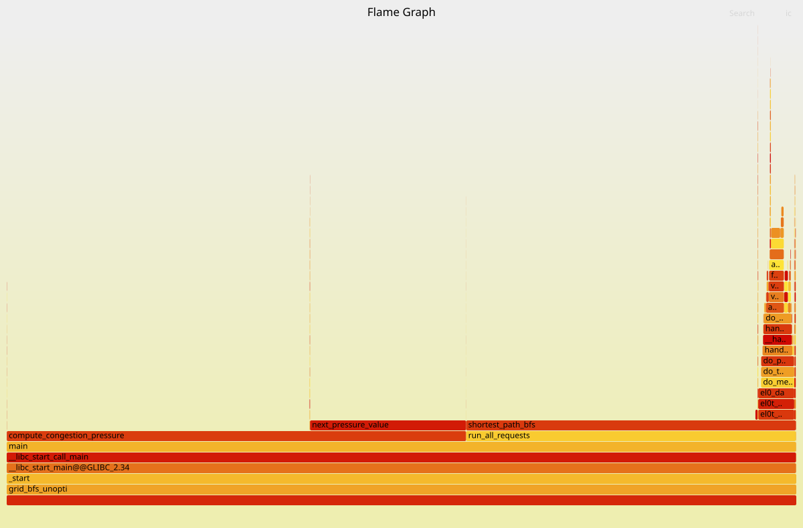
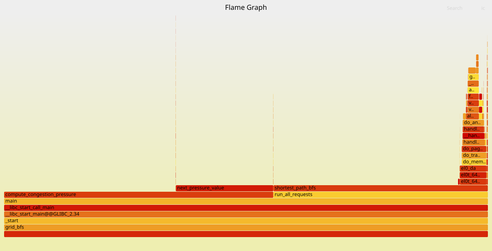

# Intro Profiling Lab Report

## 1. Optimizations Made

- changed the grid from a 2d vector of strings to a flat 1d array, which improved cache locality and reduced pointer chasing.
- reused the bfs `distance` and `frontier` buffers instead of allocating them for every bfs call.
- removed `visited` and used `distance != -1`
- changed the congestion loop to use row major traversal so memory is accessed in a cache friendly order.
- replaced divisions with bit shifts in `next_pressure_value`, which reduced instruction count but only gave negligble improvement
- simplified the branching in `next_pressure_value` so the common case is cheaper but only gave negligble improvement
- changed the heatmap and congestion buffers from `int` to `uint16_t`; this reduced memory usage but only gave negligble improvement
- added `__restrict__` in congestion to help the compiler optimize memory access
- used openmp to parallelize route, previously my time was at `0.16s` but now its 1 core its down to `0.55`, so now i changed the compiler flag so that it ignores pragmas for openmp.
- enabled `-o3` and `-march=native`, this ended up giving one of the biggest speedups overall.
- used a simple reset of the distance array, which turned out to be faster than resetting only visited nodes because of no scatter writes.

## 2. Methodology Walkthrough

Include before/after evidence from:

- `time`
Before - 

```bash
user@anurag:~/coding-labs/assignment4-profiling/lab1$ time ./grid_bfs_unoptimized
grid = 260 x 260
open_cells = 51260
requests = 1200
reachable = 1177
unreachable = 23
average_distance = 180.575
route_label_checksum = 3703473789245134517
heatmap_total_visits = 32914184
heatmap_active_cells = 51041
heatmap_max_visits = 957
heatmap_threshold_checksum = 17645577948039157950
congestion_passes = 4096
congestion_total_pressure = 3719781
congestion_max_pressure = 175
congestion_pressure_checksum = 5595025244828244209
time_sec = 1.27932

real	0m1.304s
user	0m1.194s
sys	    0m0.102s
```

After - 

```bash
user@anurag:~/coding-labs/assignment4-profiling/lab1$ time ./grid_bfs
grid = 260 x 260
open_cells = 51260
requests = 1200
reachable = 1177
unreachable = 23
average_distance = 180.575
route_label_checksum = 3703473789245134517
heatmap_total_visits = 32914184
heatmap_active_cells = 51041
heatmap_max_visits = 957
heatmap_threshold_checksum = 17645577948039157950
congestion_passes = 4096
congestion_total_pressure = 3719781
congestion_max_pressure = 175
congestion_pressure_checksum = 5595025244828244209
time_sec = 0.558004

real	0m0.560s
user	0m0.556s
sys	0m0.003s
```


- `perf stat`

Before - 
```bash
user@anurag:~/coding-labs/assignment4-profiling/lab1$ taskset -c 0 perf stat -e cycles,instructions,branches,branch-misses,cache-references,cache-misses,L1-dcache-loads,L1-dcache-load-misses ./grid_bfs_unoptimized
grid = 260 x 260
open_cells = 51260
requests = 1200
reachable = 1177
unreachable = 23
average_distance = 180.575
route_label_checksum = 3703473789245134517
heatmap_total_visits = 32914184
heatmap_active_cells = 51041
heatmap_max_visits = 957
heatmap_threshold_checksum = 17645577948039157950
congestion_passes = 4096
congestion_total_pressure = 3719781
congestion_max_pressure = 175
congestion_pressure_checksum = 5595025244828244209
time_sec = 1.36748

 Performance counter stats for './grid_bfs_unoptimized':

        3559895070      cycles                                                                  (37.83%)
        9241280386      instructions                     #    2.60  insn per cycle              (37.56%)
         735875785      branches                                                                (37.57%)
          48819968      branch-misses                    #    6.63% of all branches             (24.97%)
        3459644620      cache-references                                                        (24.94%)
         592895411      cache-misses                     #   17.14% of all cache refs           (24.84%)
        3427698155      L1-dcache-loads                                                         (24.99%)
         580029206      L1-dcache-load-misses            #   16.92% of all L1-dcache accesses   (25.13%)

       1.397370548 seconds time elapsed

       1.228840000 seconds user
       0.127294000 seconds sys

```

After - 

```bash
user@anurag:~/coding-labs/assignment4-profiling/lab1$ taskset -c 0 perf stat -e cycles,instructions,branches,branch-misses,cache-references,cache-misses,L1-dcache-loads,L1-dcache-load-misses ./grid_bfs
grid = 260 x 260
open_cells = 51260
requests = 1200
reachable = 1177
unreachable = 23
average_distance = 180.575
route_label_checksum = 3703473789245134517
heatmap_total_visits = 32914184
heatmap_active_cells = 51041
heatmap_max_visits = 957
heatmap_threshold_checksum = 17645577948039157950
congestion_passes = 4096
congestion_total_pressure = 3719781
congestion_max_pressure = 175
congestion_pressure_checksum = 5595025244828244209
time_sec = 0.576626

 Performance counter stats for './grid_bfs':

        1549663217      cycles                                                                  (37.52%)
        4344404624      instructions                     #    2.80  insn per cycle              (37.61%)
         569458434      branches                                                                (37.69%)
          40296647      branch-misses                    #    7.08% of all branches             (24.99%)
        1457907666      cache-references                                                        (24.89%)
          28494202      cache-misses                     #    1.95% of all cache refs           (24.93%)
        1460230297      L1-dcache-loads                                                         (24.94%)
          27635255      L1-dcache-load-misses            #    1.89% of all L1-dcache accesses   (24.95%)

       0.578365021 seconds time elapsed

       0.575845000 seconds user
       0.000997000 seconds sys
```

- FlameGraph

Before - 



After - 




- Callgrind/KCachegrind
Callgrind - 

Before - 
```bash
user@anurag:~/coding-labs/assignment4-profiling/lab1$ taskset -c 0 valgrind --tool=callgrind --cache-sim=yes ./grid_bfs_unoptimized --small
==9940== Callgrind, a call-graph generating cache profiler
==9940== Copyright (C) 2002-2017, and GNU GPL'd, by Josef Weidendorfer et al.
==9940== Using Valgrind-3.22.0 and LibVEX; rerun with -h for copyright info
==9940== Command: ./grid_bfs_unoptimized --small
==9940== 
--9940-- Warning: Cannot auto-detect cache config, using defaults.
--9940--          Run with -v to see.
==9940== For interactive control, run 'callgrind_control -h'.
==9940== brk segment overflow in thread #1: can't grow to 0x4887000
==9940== (see section Limitations in user manual)
==9940== NOTE: further instances of this message will not be shown
grid = 260 x 260
open_cells = 51260
requests = 25
reachable = 25
unreachable = 0
average_distance = 219.64
route_label_checksum = 4949398082416184235
heatmap_total_visits = 658695
heatmap_active_cells = 50859
heatmap_max_visits = 25
heatmap_threshold_checksum = 16311765582170346245
congestion_passes = 32
congestion_total_pressure = 455128
congestion_max_pressure = 13
congestion_pressure_checksum = 9526609312545789406
time_sec = 2.0075
==9940== 
==9940== Events    : Ir Dr Dw I1mr D1mr D1mw ILmr DLmr DLmw
==9940== Collected : 180273361 36582684 11135852 2941 7454769 2759418 2406 398350 634576
==9940== 
==9940== I   refs:      180,273,361
==9940== I1  misses:          2,941
==9940== LLi misses:          2,406
==9940== I1  miss rate:        0.00%
==9940== LLi miss rate:        0.00%
==9940== 
==9940== D   refs:       47,718,536  (36,582,684 rd + 11,135,852 wr)
==9940== D1  misses:     10,214,187  ( 7,454,769 rd +  2,759,418 wr)
==9940== LLd misses:      1,032,926  (   398,350 rd +    634,576 wr)
==9940== D1  miss rate:        21.4% (      20.4%   +       24.8%  )
==9940== LLd miss rate:         2.2% (       1.1%   +        5.7%  )
==9940== 
==9940== LL refs:        10,217,128  ( 7,457,710 rd +  2,759,418 wr)
==9940== LL misses:       1,035,332  (   400,756 rd +    634,576 wr)
==9940== LL miss rate:          0.5% (       0.2%   +        5.7%  )
```

After - 

```bash
user@anurag:~/coding-labs/assignment4-profiling/lab1$ taskset -c 0 valgrind --tool=callgrind --cache-sim=yes ./grid_bfs --small
==9900== Callgrind, a call-graph generating cache profiler
==9900== Copyright (C) 2002-2017, and GNU GPL'd, by Josef Weidendorfer et al.
==9900== Using Valgrind-3.22.0 and LibVEX; rerun with -h for copyright info
==9900== Command: ./grid_bfs --small
==9900== 
--9900-- Warning: Cannot auto-detect cache config, using defaults.
--9900--          Run with -v to see.
==9900== For interactive control, run 'callgrind_control -h'.
disInstr(arm64): unhandled instruction 0x04FC635A
disInstr(arm64): 0000'0100 1111'1100 0110'0011 0101'1010
==9900== valgrind: Unrecognised instruction at address 0x10da2c.
==9900==    at 0x10DA2C: std::mersenne_twister_engine<unsigned long, 32ul, 624ul, 397ul, 31ul, 2567483615ul, 11ul, 4294967295ul, 7ul, 2636928640ul, 15ul, 4022730752ul, 18ul, 1812433253ul>::_M_gen_rand() (in /home/user/coding-labs/assignment4-profiling/lab1/grid_bfs)
==9900==    by 0x10D59B: int std::uniform_int_distribution<int>::operator()<std::mersenne_twister_engine<unsigned long, 32ul, 624ul, 397ul, 31ul, 2567483615ul, 11ul, 4294967295ul, 7ul, 2636928640ul, 15ul, 4022730752ul, 18ul, 1812433253ul> >(std::mersenne_twister_engine<unsigned long, 32ul, 624ul, 397ul, 31ul, 2567483615ul, 11ul, 4294967295ul, 7ul, 2636928640ul, 15ul, 4022730752ul, 18ul, 1812433253ul>&, std::uniform_int_distribution<int>::param_type const&) [clone .isra.0] (in /home/user/coding-labs/assignment4-profiling/lab1/grid_bfs)
==9900==    by 0x10D723: generate_grid[abi:cxx11](int, int) (in /home/user/coding-labs/assignment4-profiling/lab1/grid_bfs)
==9900==    by 0x1090EF: main (in /home/user/coding-labs/assignment4-profiling/lab1/grid_bfs)
==9900== Your program just tried to execute an instruction that Valgrind
==9900== did not recognise.  There are two possible reasons for this.
==9900== 1. Your program has a bug and erroneously jumped to a non-code
==9900==    location.  If you are running Memcheck and you just saw a
==9900==    warning about a bad jump, it's probably your program's fault.
==9900== 2. The instruction is legitimate but Valgrind doesn't handle it,
==9900==    i.e. it's Valgrind's fault.  If you think this is the case or
==9900==    you are not sure, please let us know and we'll try to fix it.
==9900== Either way, Valgrind will now raise a SIGILL signal which will
==9900== probably kill your program.
==9900== 
==9900== Process terminating with default action of signal 4 (SIGILL)
==9900==  Illegal opcode at address 0x10DA2C
==9900==    at 0x10DA2C: std::mersenne_twister_engine<unsigned long, 32ul, 624ul, 397ul, 31ul, 2567483615ul, 11ul, 4294967295ul, 7ul, 2636928640ul, 15ul, 4022730752ul, 18ul, 1812433253ul>::_M_gen_rand() (in /home/user/coding-labs/assignment4-profiling/lab1/grid_bfs)
==9900==    by 0x10D59B: int std::uniform_int_distribution<int>::operator()<std::mersenne_twister_engine<unsigned long, 32ul, 624ul, 397ul, 31ul, 2567483615ul, 11ul, 4294967295ul, 7ul, 2636928640ul, 15ul, 4022730752ul, 18ul, 1812433253ul> >(std::mersenne_twister_engine<unsigned long, 32ul, 624ul, 397ul, 31ul, 2567483615ul, 11ul, 4294967295ul, 7ul, 2636928640ul, 15ul, 4022730752ul, 18ul, 1812433253ul>&, std::uniform_int_distribution<int>::param_type const&) [clone .isra.0] (in /home/user/coding-labs/assignment4-profiling/lab1/grid_bfs)
==9900==    by 0x10D723: generate_grid[abi:cxx11](int, int) (in /home/user/coding-labs/assignment4-profiling/lab1/grid_bfs)
==9900==    by 0x1090EF: main (in /home/user/coding-labs/assignment4-profiling/lab1/grid_bfs)
==9900== 
==9900== Events    : Ir Dr Dw I1mr D1mr D1mw ILmr DLmr DLmw
==9900== Collected : 1542063 447351 174667 1568 16110 3889 1356 8293 2784
==9900== 
==9900== I   refs:      1,542,063
==9900== I1  misses:        1,568
==9900== LLi misses:        1,356
==9900== I1  miss rate:      0.10%
==9900== LLi miss rate:      0.09%
==9900== 
==9900== D   refs:        622,018  (447,351 rd + 174,667 wr)
==9900== D1  misses:       19,999  ( 16,110 rd +   3,889 wr)
==9900== LLd misses:       11,077  (  8,293 rd +   2,784 wr)
==9900== D1  miss rate:       3.2% (    3.6%   +     2.2%  )
==9900== LLd miss rate:       1.8% (    1.9%   +     1.6%  )
==9900== 
==9900== LL refs:          21,567  ( 17,678 rd +   3,889 wr)
==9900== LL misses:        12,433  (  9,649 rd +   2,784 wr)
==9900== LL miss rate:        0.6% (    0.5%   +     1.6%  )
Illegal instruction (core dumped)
```

I couldn't use kcachegrind since I was doing experiments on the ec2 server, I had to use callgrind_annotate.

- Valgrind leak summary

Before -
```bash
user@anurag:~/coding-labs/assignment4-profiling/lab1$ taskset -c 0 valgrind --leak-check=full --show-leak-kinds=all --track-origins=yes ./grid_bfs_unoptimized
==9741== Memcheck, a memory error detector
==9741== Copyright (C) 2002-2022, and GNU GPL'd, by Julian Seward et al.
==9741== Using Valgrind-3.22.0 and LibVEX; rerun with -h for copyright info
==9741== Command: ./grid_bfs_unoptimized
==9741== 
grid = 260 x 260
open_cells = 51260
requests = 1200
reachable = 1177
unreachable = 23
average_distance = 180.575
route_label_checksum = 3703473789245134517
heatmap_total_visits = 32914184
heatmap_active_cells = 51041
heatmap_max_visits = 957
heatmap_threshold_checksum = 17645577948039157950
congestion_passes = 4096
congestion_total_pressure = 3719781
congestion_max_pressure = 175
congestion_pressure_checksum = 5595025244828244209
time_sec = 266.585
==9741== 
==9741== HEAP SUMMARY:
==9741==     in use at exit: 405,600,000 bytes in 2,400 blocks
==9741==   total heap usage: 5,069 allocs, 2,669 frees, 1,055,849,193 bytes allocated
==9741== 
==9741== 202,800 bytes in 3 blocks are possibly lost in loss record 1 of 4
==9741==    at 0x4886FFC: operator new[](unsigned long) (in /usr/libexec/valgrind/vgpreload_memcheck-arm64-linux.so)
==9741==    by 0x10B19B: shortest_path_bfs(std::vector<std::__cxx11::basic_string<char, std::char_traits<char>, std::allocator<char> >, std::allocator<std::__cxx11::basic_string<char, std::char_traits<char>, std::allocator<char> > > > const&, RouteRequest const&, std::vector<int, std::allocator<int> >&) (grid_bfs_unoptimized.cpp:198)
==9741==    by 0x10B5EF: run_all_requests(std::vector<std::__cxx11::basic_string<char, std::char_traits<char>, std::allocator<char> >, std::allocator<std::__cxx11::basic_string<char, std::char_traits<char>, std::allocator<char> > > > const&, std::vector<RouteRequest, std::allocator<RouteRequest> > const&, std::vector<int, std::allocator<int> >&) (grid_bfs_unoptimized.cpp:262)
==9741==    by 0x10C73F: main (grid_bfs_unoptimized.cpp:487)
==9741== 
==9741== 3,244,800 bytes in 12 blocks are possibly lost in loss record 2 of 4
==9741==    at 0x4886FFC: operator new[](unsigned long) (in /usr/libexec/valgrind/vgpreload_memcheck-arm64-linux.so)
==9741==    by 0x10B15F: shortest_path_bfs(std::vector<std::__cxx11::basic_string<char, std::char_traits<char>, std::allocator<char> >, std::allocator<std::__cxx11::basic_string<char, std::char_traits<char>, std::allocator<char> > > > const&, RouteRequest const&, std::vector<int, std::allocator<int> >&) (grid_bfs_unoptimized.cpp:196)
==9741==    by 0x10B5EF: run_all_requests(std::vector<std::__cxx11::basic_string<char, std::char_traits<char>, std::allocator<char> >, std::allocator<std::__cxx11::basic_string<char, std::char_traits<char>, std::allocator<char> > > > const&, std::vector<RouteRequest, std::allocator<RouteRequest> > const&, std::vector<int, std::allocator<int> >&) (grid_bfs_unoptimized.cpp:262)
==9741==    by 0x10C73F: main (grid_bfs_unoptimized.cpp:487)
==9741== 
==9741== 80,917,200 bytes in 1,197 blocks are definitely lost in loss record 3 of 4
==9741==    at 0x4886FFC: operator new[](unsigned long) (in /usr/libexec/valgrind/vgpreload_memcheck-arm64-linux.so)
==9741==    by 0x10B19B: shortest_path_bfs(std::vector<std::__cxx11::basic_string<char, std::char_traits<char>, std::allocator<char> >, std::allocator<std::__cxx11::basic_string<char, std::char_traits<char>, std::allocator<char> > > > const&, RouteRequest const&, std::vector<int, std::allocator<int> >&) (grid_bfs_unoptimized.cpp:198)
==9741==    by 0x10B5EF: run_all_requests(std::vector<std::__cxx11::basic_string<char, std::char_traits<char>, std::allocator<char> >, std::allocator<std::__cxx11::basic_string<char, std::char_traits<char>, std::allocator<char> > > > const&, std::vector<RouteRequest, std::allocator<RouteRequest> > const&, std::vector<int, std::allocator<int> >&) (grid_bfs_unoptimized.cpp:262)
==9741==    by 0x10C73F: main (grid_bfs_unoptimized.cpp:487)
==9741== 
==9741== 321,235,200 bytes in 1,188 blocks are definitely lost in loss record 4 of 4
==9741==    at 0x4886FFC: operator new[](unsigned long) (in /usr/libexec/valgrind/vgpreload_memcheck-arm64-linux.so)
==9741==    by 0x10B15F: shortest_path_bfs(std::vector<std::__cxx11::basic_string<char, std::char_traits<char>, std::allocator<char> >, std::allocator<std::__cxx11::basic_string<char, std::char_traits<char>, std::allocator<char> > > > const&, RouteRequest const&, std::vector<int, std::allocator<int> >&) (grid_bfs_unoptimized.cpp:196)
==9741==    by 0x10B5EF: run_all_requests(std::vector<std::__cxx11::basic_string<char, std::char_traits<char>, std::allocator<char> >, std::allocator<std::__cxx11::basic_string<char, std::char_traits<char>, std::allocator<char> > > > const&, std::vector<RouteRequest, std::allocator<RouteRequest> > const&, std::vector<int, std::allocator<int> >&) (grid_bfs_unoptimized.cpp:262)
==9741==    by 0x10C73F: main (grid_bfs_unoptimized.cpp:487)
==9741== 
==9741== LEAK SUMMARY:
==9741==    definitely lost: 402,152,400 bytes in 2,385 blocks
==9741==    indirectly lost: 0 bytes in 0 blocks
==9741==      possibly lost: 3,447,600 bytes in 15 blocks
==9741==    still reachable: 0 bytes in 0 blocks
==9741==         suppressed: 0 bytes in 0 blocks
==9741== 
==9741== For lists of detected and suppressed errors, rerun with: -s
==9741== ERROR SUMMARY: 4 errors from 4 contexts (suppressed: 0 from 0)
user@anurag:~/coding-labs/assignment4-profiling/lab1$ 
```

After -
```bash
user@anurag:~/coding-labs/assignment4-profiling/lab1$ taskset -c 0 valgrind --leak-check=full --show-leak-kinds=all --track-origins=yes ./grid_bfs
==9789== Memcheck, a memory error detector
==9789== Copyright (C) 2002-2022, and GNU GPL'd, by Julian Seward et al.
==9789== Using Valgrind-3.22.0 and LibVEX; rerun with -h for copyright info
==9789== Command: ./grid_bfs
==9789== 
grid = 260 x 260
open_cells = 51260
requests = 1200
reachable = 1177
unreachable = 23
average_distance = 180.575
route_label_checksum = 3703473789245134517
heatmap_total_visits = 32914184
heatmap_active_cells = 51041
heatmap_max_visits = 957
heatmap_threshold_checksum = 17645577948039157950
congestion_passes = 4096
congestion_total_pressure = 3719781
congestion_max_pressure = 175
congestion_pressure_checksum = 5595025244828244209
time_sec = 24.6966
==9789== 
==9789== HEAP SUMMARY:
==9789==     in use at exit: 0 bytes in 0 blocks
==9789==   total heap usage: 1,211 allocs, 1,211 frees, 1,415,553 bytes allocated
==9789== 
==9789== All heap blocks were freed -- no leaks are possible
==9789== 
==9789== For lists of detected and suppressed errors, rerun with: -s
==9789== ERROR SUMMARY: 0 errors from 0 contexts (suppressed: 0 from 0)

```

## 3. Correctness Evidence

Include:

- `make test`

```bash
user@anurag:~/coding-labs/assignment4-profiling/lab1$ make test
g++ -std=c++20 -Wall -Wextra -pedantic -O3 -march=native -fopt-info-vec-optimized grid_bfs.cpp -o grid_bfs
grid_bfs.cpp:245: warning: ignoring ‘#pragma omp parallel’ [-Wunknown-pragmas]
  245 |     #pragma omp parallel
grid_bfs.cpp:255: warning: ignoring ‘#pragma omp for’ [-Wunknown-pragmas]
  255 |         #pragma omp for nowait
grid_bfs.cpp:271: warning: ignoring ‘#pragma omp critical’ [-Wunknown-pragmas]
  271 |         #pragma omp critical
grid_bfs.cpp:316:45: optimized: loop vectorized using 16 byte vectors
grid_bfs.cpp:316:45: optimized: loop vectorized using variable length vectors
grid_bfs.cpp:374:35: optimized: loop vectorized using variable length vectors
grid_bfs.cpp:374:35: optimized:  loop versioned for vectorization because of possible aliasing
grid_bfs.cpp:363:26: optimized: loop vectorized using 16 byte vectors
grid_bfs.cpp:363:26: optimized:  loop versioned for vectorization because of possible aliasing
grid_bfs.cpp:363:26: optimized: loop vectorized using variable length vectors
/usr/include/c++/14/bits/stl_algobase.h:2152:22: optimized: loop vectorized using variable length vectors
/usr/include/c++/14/bits/stl_algobase.h:2152:22: optimized: loop vectorized using variable length vectors
/usr/include/c++/14/bits/stl_algobase.h:2152:22: optimized: loop vectorized using variable length vectors
/usr/include/c++/14/bits/stl_algobase.h:2152:22: optimized: loop vectorized using variable length vectors
grid_bfs.cpp:278:30: optimized: loop vectorized using 16 byte vectors
grid_bfs.cpp:278:30: optimized:  loop versioned for vectorization because of possible aliasing
grid_bfs.cpp:278:30: optimized: loop vectorized using variable length vectors
/usr/include/c++/14/bits/random.tcc:412:42: optimized: loop vectorized using 16 byte vectors
/usr/include/c++/14/bits/random.tcc:404:32: optimized: loop vectorized using 16 byte vectors
./grid_bfs --test
sanity check passed
```

- Final normal run output
```bash
user@anurag:~/coding-labs/assignment4-profiling/lab1$ ./grid_bfs
grid = 260 x 260
open_cells = 51260
requests = 1200
reachable = 1177
unreachable = 23
average_distance = 180.575
route_label_checksum = 3703473789245134517
heatmap_total_visits = 32914184
heatmap_active_cells = 51041
heatmap_max_visits = 957
heatmap_threshold_checksum = 17645577948039157950
congestion_passes = 4096
congestion_total_pressure = 3719781
congestion_max_pressure = 175
congestion_pressure_checksum = 5595025244828244209
time_sec = 0.55877
```

- Checksum comparison before and after optimization

| Function / Metric | Unoptimized | Optimized |
|----------|----------:|----------:|
| Route Label Checksum | 3703473789245134517 | 3703473789245134517 |
| Heatmap Threshold Checksum | 17645577948039157950 | 17645577948039157950 |
| Congestion Pressure Checksum | 5595025244828244209 | 5595025244828244209 |

## 4. Conceptual Questions

Answer Q1.1 through Q6.1 from the README.

Q1.1 - 
in the `time` command output, `user+sys` is not `real` because user and sys give us the cpu time while real is wall time, so there can be a few tasks in b/w which blocks cpu from doing current task or you can be doing multithreading so cpu time can be more than the wall clock time.

Q2.1 -
they are calculated using PMUs (performance monitoring units), these are specific counters which are made to increment on a specific condition (i.e. branch miss of l1 cache read miss). other derived metrics are calculated from these raw event counts such as instructions per cycles or % of all cache references, etc..

Q2.2 - 
the right side is about how much times a certain stat was measured (percentage of the program's time in which that event was measuerd) because like we have only a specific amount of PMUs and when you have a lot of metrics to compute, they have to share the same PMUs, so they get their part of sampling and then it is accordingly scaled.

Q2.3 - 
Its not because according to the above answer, perf can share events on the same PMU, so we have a certain percentage of data about the metric and then it scales accordingly, so its more of a statistical approximation rather than the actual quantity.

Q3.1 -
frame pointers point to current stack frame which have previous frame pointers, so it forms a chain through call stack, when we use perf -g, perf can walk through this chain which allows it to build call graph

Q3.2 - 
Inclusive cost is the time spent either in the function or the function it called so it includes children cost as well. Self cost is the time spent in that function only not in any other called function.

Q4.1 -
gprof inserts extra code at start of each function which records when we enter that function and what aclled it, while the program runs it also samples the program counter to estimate where time is spent. after execution it uses all that info with sampling data to build the call graph and estimate how much time was spent in each function and its children.

Q4.2 -
even though we have modern tools like perf or flamegraph, i used gprof here because it provides a neat and clean call graph which depicts how time is distributed accross a function and the stuff it calls, it also helps in finding hotspots in certain calls or certain type of calls thus capturing a more semantic and natural view of the program.

Q5.1 - 
on a high level, valgrind is more like a runtime tool and address sanitizers are compile time, you compile your program with specific flags which injects certain instructions to detect memory anomalies (like buffer overflow, invalid memory access, etc.), valgrind makes more of a virtual layer around your compiled binary, it takes the instructions, and then injects its own to detect the simmilar stuff, the same idea, just executed differently.

address sanitizers are faster because you inject all of the instructions in compile time rather than using jit stuff like valgrind does, which automatically makes it slower. address sanitizer would be perferred normally because of its low overhead. 

valgrind would be used when a detailed check is required or investigating difficult bugs that address sanitizer may not catch.

Q6.1 - 
gprof kind of disagreed with perf because like gprof was using an unoptimized binary so it included stuff like `operator[]` is a hotspot (like showed its high percentage) although optimizations optimize such stuff away, but i took both of their inputs and thought logically here, its not a real contradiction though, its a difference in measurement method. the reason we don't use optimized binaries with gprof is that it can yield some things that we might not understand because stuff like functions will get inlined.